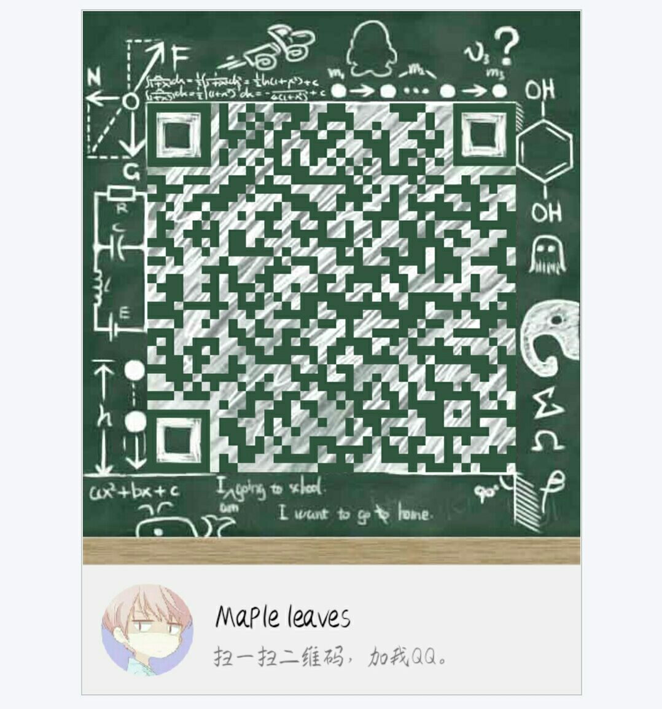

## My solutions to Leetcode

I will put my solutions to [Leetcode Problems](https://leetcode.com/problemset/all/) in this repo. Every problem will be solved in C++；

---

这是我的 **Leetcode** 题解代码仓，所有问题都会使用C++进行解决，个别问题支持Java语言

**个人QQ**：

## Problems

| ID| Problem| C++ | Java |
| --- | --- | --- | --- |
| 001 | [Two Sum](https://leetcode-cn.com/problems/two-sum/) | [C++](0001-Two-Sum/main.cpp)|
